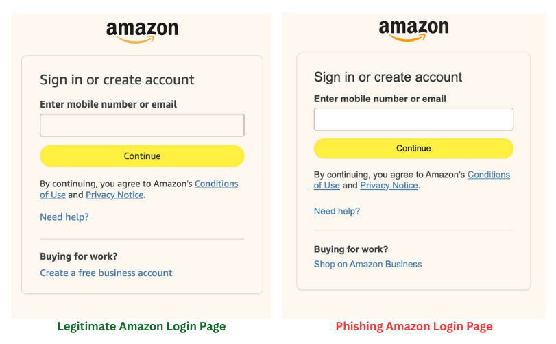

# Cybersecurity: Phishing Simulator

## Table of Contents
1. [Overview](#overview)
1. [Prerequisites](#prerequisites)
1. [How to run the project](#how-to-run-the-project)
1. [Ethics](#ethics)
1. [Disclaimer](#disclaimer)

## Overview
- This project demonstrates common phishing UI patterns in a closed, local environment to support security-awareness training.
- The site `amazon.com` is used as the base-line dummy data due to its popularity.

## Prerequisites
- Dev Container
- Test data only (no real accounts)

## How to run the project
- Open the project in a Dev container.
- Follow instructions to sign the trust certificate "[trusting_cert_instructions.md](trust_cert_instructions.md)"
- Run the following commands:
  - `python3 ./collect.py`
  - `python3 ./phishing.py`
- Open browser with the URL: `https://localhost:4443/amazon-login.html#`
- Now enter email and password (does not have to be correct), then click Sign-in. It intentionally prompts for incorrect credentials, keep entering your input 3 times.
- At the third time, it should automatically navigate back to the legitimate unauthenticated Amazon home page.
- Go back to the project folder, a new generated file `stolen.txt` has captured provided credentials.

## Ethics
- For educational use in a controlled environment only.
- Do not use real brands, trademarks, or real credentials.
- Do not deploy publicly or target non-consenting users.
- The simulator stores only nonsensitive placeholders.
- No external transmission of data.

## Disclaimer
This simulator is for ethical training only and must remain in a closed environment with explicit consent.

